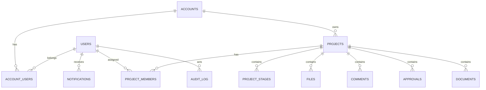

# Схема базы данных сайта

## 1. Общий принцип

База сайта хранит:
- аккаунты и роли
- проекты и клиентский кабинет
- комментарии, согласования, уведомления
- файлы и версии
- журнал действий
- интеграционные ключи и синхронизацию с Bitrix24

База сайта не должна хранить лишние CRM-данные, которые и так живут в Bitrix24, если они не нужны для UX и аналитики кабинета.

## 2. Основные таблицы

## 2.1 users
| Поле | Тип | Описание |
|---|---|---|
| id | uuid pk | ID пользователя |
| email | varchar unique | Email |
| phone | varchar | Телефон |
| password_hash | varchar nullable | Если используется пароль |
| first_name | varchar | Имя |
| last_name | varchar | Фамилия |
| status | enum | invited / active / blocked / deleted |
| last_login_at | timestamptz | Последний вход |
| created_at | timestamptz | Создан |
| updated_at | timestamptz | Обновлен |

## 2.2 accounts
Компания клиента или внутренняя учетная сущность.

| Поле | Тип | Описание |
|---|---|---|
| id | uuid pk | ID аккаунта |
| type | enum | client / internal |
| name | varchar | Название |
| legal_name | varchar | Юрназвание |
| inn | varchar nullable | ИНН |
| bitrix_company_id | bigint nullable | Связь с Company |
| created_at | timestamptz | Создан |
| updated_at | timestamptz | Обновлен |

## 2.3 account_users
Связь пользователей и аккаунтов.

| Поле | Тип |
|---|---|
| id | uuid pk |
| account_id | uuid fk |
| user_id | uuid fk |
| role | enum |
| is_owner | bool |
| created_at | timestamptz |

## 2.4 projects
Главная проектная сущность сайта.

| Поле | Тип | Описание |
|---|---|---|
| id | uuid pk | ID проекта |
| account_id | uuid fk | Клиентский аккаунт |
| title | varchar | Название проекта |
| slug | varchar unique | URL slug |
| direction | enum | marketing / event / branding / digital / strategy / production |
| status | enum | active / paused / completed / archived |
| stage_code | varchar | Текущий этап |
| manager_user_id | uuid fk nullable | Менеджер |
| owner_user_id | uuid fk nullable | Владелец внутри студии |
| description | text | Описание |
| start_date | date nullable | Старт |
| planned_deadline | date nullable | Плановый дедлайн |
| actual_deadline | date nullable | Факт |
| bitrix_deal_id | bigint nullable | ID сделки |
| bitrix_contact_id | bigint nullable | Основной контакт |
| bitrix_company_id | bigint nullable | Компания |
| visibility_mode | enum | client_visible / internal_only |
| created_at | timestamptz | Создан |
| updated_at | timestamptz | Обновлен |

## 2.5 project_members
| Поле | Тип |
|---|---|
| id | uuid pk |
| project_id | uuid fk |
| user_id | uuid fk |
| role | enum |
| is_client_side | bool |
| can_approve | bool |
| can_view_finance_docs | bool |
| created_at | timestamptz |

## 2.6 project_stages
| Поле | Тип |
|---|---|
| id | uuid pk |
| project_id | uuid fk |
| code | varchar |
| title | varchar |
| sort_order | int |
| status | enum |
| starts_at | timestamptz nullable |
| due_at | timestamptz nullable |
| completed_at | timestamptz nullable |
| is_client_visible | bool |
| created_at | timestamptz |
| updated_at | timestamptz |

## 2.7 briefs
| Поле | Тип |
|---|---|
| id | uuid pk |
| project_id | uuid fk nullable |
| lead_external_id | varchar nullable |
| type | enum |
| payload_json | jsonb |
| status | enum |
| submitted_by_user_id | uuid fk nullable |
| created_at | timestamptz |
| updated_at | timestamptz |

## 2.8 files
| Поле | Тип |
|---|---|
| id | uuid pk |
| project_id | uuid fk nullable |
| account_id | uuid fk nullable |
| uploaded_by_user_id | uuid fk |
| bucket | varchar |
| object_key | varchar |
| original_name | varchar |
| mime_type | varchar |
| size_bytes | bigint |
| file_category | enum |
| version_no | int |
| is_client_visible | bool |
| bitrix_file_id | varchar nullable |
| created_at | timestamptz |

## 2.9 comments
| Поле | Тип |
|---|---|
| id | uuid pk |
| project_id | uuid fk |
| author_user_id | uuid fk |
| parent_id | uuid fk nullable |
| body | text |
| comment_type | enum |
| visibility | enum |
| related_stage_id | uuid fk nullable |
| related_file_id | uuid fk nullable |
| created_at | timestamptz |
| updated_at | timestamptz |

## 2.10 approvals
| Поле | Тип |
|---|---|
| id | uuid pk |
| project_id | uuid fk |
| stage_id | uuid fk nullable |
| title | varchar |
| description | text |
| status | enum |
| requested_by_user_id | uuid fk |
| decided_by_user_id | uuid fk nullable |
| decided_at | timestamptz nullable |
| decision_comment | text nullable |
| created_at | timestamptz |
| updated_at | timestamptz |

## 2.11 documents
| Поле | Тип |
|---|---|
| id | uuid pk |
| project_id | uuid fk nullable |
| account_id | uuid fk nullable |
| document_type | enum |
| title | varchar |
| file_id | uuid fk nullable |
| bitrix_document_id | varchar nullable |
| sign_status | enum |
| is_client_visible | bool |
| created_at | timestamptz |
| updated_at | timestamptz |

## 2.12 notifications
| Поле | Тип |
|---|---|
| id | uuid pk |
| user_id | uuid fk |
| type | enum |
| title | varchar |
| body | text |
| payload_json | jsonb |
| is_read | bool |
| read_at | timestamptz nullable |
| created_at | timestamptz |

## 2.13 audit_log
| Поле | Тип |
|---|---|
| id | uuid pk |
| actor_user_id | uuid fk nullable |
| entity_type | varchar |
| entity_id | varchar |
| action | varchar |
| payload_before | jsonb nullable |
| payload_after | jsonb nullable |
| ip | varchar nullable |
| user_agent | text nullable |
| created_at | timestamptz |

## 2.14 integrations_bitrix_queue
Очередь обмена с CRM.

| Поле | Тип |
|---|---|
| id | uuid pk |
| direction | enum |
| entity_type | varchar |
| entity_id | varchar |
| operation | varchar |
| payload_json | jsonb |
| status | enum |
| retry_count | int |
| last_error | text nullable |
| next_retry_at | timestamptz nullable |
| created_at | timestamptz |
| updated_at | timestamptz |

## 2.15 integrations_bitrix_links
| Поле | Тип |
|---|---|
| id | uuid pk |
| local_entity_type | varchar |
| local_entity_id | uuid |
| bitrix_entity_type | varchar |
| bitrix_entity_id | bigint |
| created_at | timestamptz |
| updated_at | timestamptz |

## 3. Индексы

Нужны индексы по:
- `projects.account_id`
- `projects.bitrix_deal_id`
- `project_members.project_id`
- `files.project_id`
- `comments.project_id`
- `notifications.user_id, is_read`
- `audit_log.entity_type, entity_id`
- `integrations_bitrix_queue.status, next_retry_at`

## 4. Мягкое удаление

Для критичных сущностей лучше использовать soft delete:
- users
- accounts
- projects
- files
- documents

## 5. Версионирование

Для файлов и статусов нужен след:
- версия файла
- кто загрузил
- кто согласовал
- когда заменили
- что было до изменения

## 6. Mermaid-схема связей

## 7. Что не хранить в БД сайта без нужды

- полную дубль-копию всех сделок Bitrix24
- полную историю CRM таймлайна
- все системные поля CRM
- лишние маркетинговые метки без практического применения

## 8. Минимум для MVP

Если нужен быстрый старт, обязательны:
- users
- accounts
- account_users
- projects
- project_members
- project_stages
- files
- comments
- approvals
- notifications
- integrations_bitrix_queue
- integrations_bitrix_links
